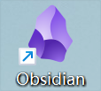

# unity-learning-sharing
分享unity学习过程中的一点经验和心得

相关文章主要发布在我的csdn博客上 昵称：|Ringleader| 地址：https://blog.csdn.net/weixin_44013533/category_12245007.html

使用的markdown工具是obsidian 
测试github绝对路径：
测试github绝对路径+jsdelivr cdn加速：
测试根目录下相对路径图片：

测试html图片格式：

